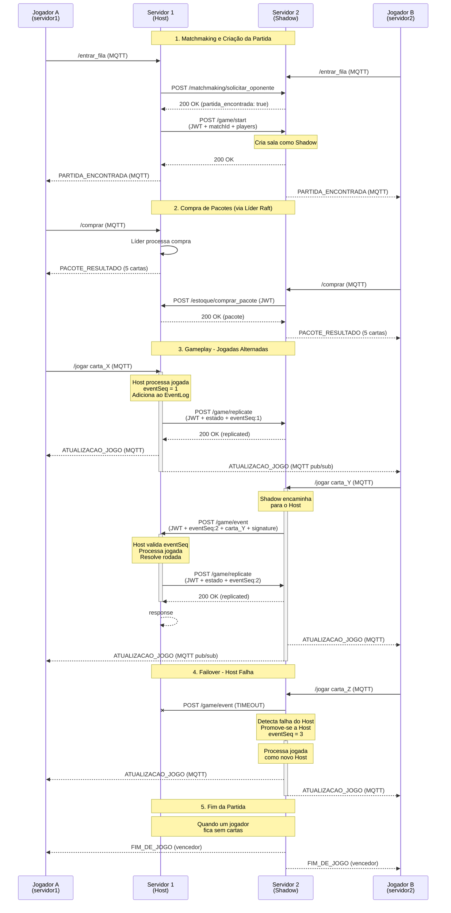

# 🎮 Arquitetura Cross-Server - Jogo de Cartas Distribuído

## 📋 Visão Geral

Este documento descreve a arquitetura de comunicação cross-server implementada para permitir que jogadores conectados a diferentes servidores de jogo possam jogar partidas juntos de forma sincronizada e tolerante a falhas.

## 🏗️ Arquitetura Host + Shadow

### Papéis dos Servidores

#### **Host (Servidor Principal)**
- Mantém o estado oficial da partida
- Valida todas as jogadas e aplica as regras do jogo
- Gera e incrementa o `eventSeq` para cada evento
- Mantém o event log append-only
- Replica o estado para o servidor Shadow após cada mudança

#### **Shadow (Servidor Réplica)**
- Mantém uma cópia sincronizada do estado da partida
- Recebe eventos dos seus jogadores locais
- Encaminha eventos para o Host via REST API
- Recebe replicações de estado do Host
- Assume o papel de Host em caso de falha (Failover)

## 🔐 Segurança

### Autenticação JWT

Todos os endpoints REST de comunicação cross-server utilizam autenticação JWT Bearer.

**Header de Autenticação:**
```http
Authorization: Bearer <JWT_TOKEN>
```

**Estrutura do Token JWT:**
```json
{
  "alg": "HS256",
  "typ": "JWT"
}
.
{
  "server_id": "servidor1",
  "exp": 1735689600,
  "iat": 1735603200
}
```

### Assinatura HMAC

Cada evento crítico é assinado com HMAC-SHA256 para garantir integridade:

```
signature = HMAC-SHA256(eventSeq:matchId:eventType:playerId, SECRET_KEY)
```

## 📡 Endpoints REST

### 1. POST `/game/start`

Cria uma nova partida e envia o estado inicial ao servidor Shadow.

**Headers:**
```http
Content-Type: application/json
Authorization: Bearer <JWT_TOKEN>
```

**Request Body:**
```json
{
  "matchId": "76b638b2-8d6d-45a9-bcca-5f01b6a74cc6",
  "hostServer": "servidor1:8080",
  "players": [
    {
      "id": "b3f0f70a-f525-4260-8dfc-1f03b99c9af8",
      "nome": "Marcelo",
      "server": "servidor1:8080"
    },
    {
      "id": "e3b4d184-5c77-461e-9f72-ea95ce00def6",
      "nome": "Felipe",
      "server": "servidor2:8080"
    }
  ],
  "token": "<JWT_TOKEN>"
}
```

**Response (200 OK):**
```json
{
  "status": "created",
  "matchId": "76b638b2-8d6d-45a9-bcca-5f01b6a74cc6",
  "host": "servidor1:8080",
  "shadow": "servidor2:8080"
}
```

**Fluxo:**
1. O Host recebe a requisição e cria a sala
2. Define qual servidor será o Shadow (servidor do jogador remoto)
3. Cria o evento inicial (`MATCH_START`) com `eventSeq = 0`
4. Envia o estado inicial para o Shadow via `/game/replicate`

---

### 2. POST `/game/event`

Recebe eventos de jogo de jogadores remotos (do servidor Shadow para o Host).

**Headers:**
```http
Content-Type: application/json
Authorization: Bearer <JWT_TOKEN>
```

**Request Body:**
```json
{
  "matchId": "76b638b2-8d6d-45a9-bcca-5f01b6a74cc6",
  "eventSeq": 3,
  "eventType": "CARD_PLAYED",
  "playerId": "e3b4d184-5c77-461e-9f72-ea95ce00def6",
  "data": {
    "carta_id": "Abc12"
  },
  "token": "<JWT_TOKEN>",
  "signature": "dGVzdF9zaWduYXR1cmU="
}
```

**Response (200 OK):**
```json
{
  "status": "processed",
  "eventSeq": 3,
  "state": {
    "sala_id": "76b638b2-8d6d-45a9-bcca-5f01b6a74cc6",
    "estado": "JOGANDO",
    "cartas_na_mesa": {
      "Felipe": {
        "id": "Abc12",
        "nome": "Dragão",
        "naipe": "♠",
        "valor": 85,
        "raridade": "R"
      }
    },
    "pontos_rodada": {},
    "pontos_partida": {},
    "numero_rodada": 1,
    "prontos": {},
    "eventSeq": 3
  }
}
```

**Validações:**
- ✅ Verifica se o servidor é o Host
- ✅ Valida `eventSeq` (deve ser maior que o atual - previne replay attacks)
- ✅ Verifica assinatura HMAC se fornecida
- ✅ Adiciona evento ao event log
- ✅ Processa a lógica do jogo
- ✅ Replica estado para o Shadow

**Erro - Event Desatualizado (409 Conflict):**
```json
{
  "error": "Evento desatualizado ou duplicado"
}
```

---

### 3. POST `/game/replicate`

Recebe replicação de estado do Host (quando este servidor é Shadow).

**Headers:**
```http
Content-Type: application/json
Authorization: Bearer <JWT_TOKEN>
```

**Request Body:**
```json
{
  "matchId": "76b638b2-8d6d-45a9-bcca-5f01b6a74cc6",
  "eventSeq": 5,
  "state": {
    "sala_id": "76b638b2-8d6d-45a9-bcca-5f01b6a74cc6",
    "estado": "JOGANDO",
    "cartas_na_mesa": {
      "Marcelo": {
        "id": "Xyz89",
        "nome": "Fênix",
        "naipe": "♥",
        "valor": 92,
        "raridade": "L"
      },
      "Felipe": {
        "id": "Abc12",
        "nome": "Dragão",
        "naipe": "♠",
        "valor": 85,
        "raridade": "R"
      }
    },
    "pontos_rodada": {
      "Marcelo": 1
    },
    "pontos_partida": {},
    "numero_rodada": 1,
    "prontos": {},
    "eventSeq": 5,
    "eventLog": [
      {
        "eventSeq": 0,
        "matchId": "76b638b2-8d6d-45a9-bcca-5f01b6a74cc6",
        "timestamp": "2025-10-19T12:26:19Z",
        "eventType": "MATCH_START",
        "playerId": "SYSTEM",
        "data": {
          "host": "servidor1:8080",
          "shadow": "servidor2:8080"
        },
        "signature": "..."
      },
      {
        "eventSeq": 3,
        "matchId": "76b638b2-8d6d-45a9-bcca-5f01b6a74cc6",
        "timestamp": "2025-10-19T12:27:45Z",
        "eventType": "CARD_PLAYED",
        "playerId": "e3b4d184-5c77-461e-9f72-ea95ce00def6",
        "data": {
          "carta_id": "Abc12",
          "carta_nome": "Dragão",
          "carta_valor": 85
        },
        "signature": "..."
      }
    ]
  },
  "token": "<JWT_TOKEN>",
  "signature": "c3RhdGVfc2lnbmF0dXJl"
}
```

**Response (200 OK):**
```json
{
  "status": "replicated",
  "eventSeq": 5
}
```

**Response - Replicação Desatualizada (200 OK):**
```json
{
  "status": "ignored",
  "reason": "outdated"
}
```

**Validações:**
- ✅ Valida `eventSeq` (só aceita eventos mais recentes)
- ✅ Atualiza estado completo da sala
- ✅ Faz merge do event log
- ✅ Cria sala automaticamente se não existir (recuperação após falha)

---

## 🔄 Fluxo de Comunicação Cross-Server

### Cenário: Jogadores em Servidores Diferentes



---

## 🛡️ Tolerância a Falhas (Failover)

### Detecção de Falha

O servidor Shadow detecta falha do Host quando:
- Timeout em requisições REST (5 segundos)
- Status HTTP diferente de 200 OK

### Promoção Automática

Quando o Host falha:

1. **Shadow detecta timeout**
```go
resp, err := httpClient.Do(httpReq)
if err != nil {
    log.Printf("[FAILOVER] Host inacessível. Promovendo Shadow...")
    promoverSombraAHost(sala)
    processarJogadaComoHost(sala, clienteID, cartaID)
    return
}
```

2. **Shadow assume controle**
   - Atualiza `ServidorHost` para seu próprio endereço
   - Zera `ServidorSombra` (agora opera sem réplica)
   - Continua processando eventos normalmente

3. **Notifica jogadores**
```json
{
  "comando": "ATUALIZACAO_JOGO",
  "dados": {
    "mensagemDoTurno": "O servidor da partida falhou. A partida continuará em um servidor reserva."
  }
}
```

### Event Log Append-Only

O event log garante consistência mesmo após failover:

```json
[
  {
    "eventSeq": 0,
    "eventType": "MATCH_START",
    "timestamp": "2025-10-19T12:26:19Z"
  },
  {
    "eventSeq": 1,
    "eventType": "CARD_PLAYED",
    "playerId": "player_A",
    "timestamp": "2025-10-19T12:27:00Z"
  },
  {
    "eventSeq": 2,
    "eventType": "CARD_PLAYED",
    "playerId": "player_B",
    "timestamp": "2025-10-19T12:27:15Z"
  }
]
```

---

## 🧪 Testes de Conectividade

### Teste 1: Dois Jogadores em Servidores Diferentes

```bash
# Terminal 1 - Jogador conectado ao servidor 1
docker compose run --name cliente_marcelo cliente
# Escolher: 1. Servidor 1
# Nome: Marcelo

# Terminal 2 - Jogador conectado ao servidor 2
docker compose run --name cliente_felipe cliente
# Escolher: 2. Servidor 2
# Nome: Felipe
```

**Resultado Esperado:**
- ✅ Ambos entram na fila de matchmaking
- ✅ Matchmaking global encontra oponentes em servidores diferentes
- ✅ Partida é criada com Host e Shadow
- ✅ Ambos podem comprar pacotes (via líder Raft)
- ✅ Jogadas são sincronizadas via REST
- ✅ Ambos recebem atualizações de jogo via MQTT

### Teste 2: Failover do Host

```bash
# Durante uma partida ativa, derrubar o servidor Host
docker compose stop servidor1

# O servidor Shadow deve:
# 1. Detectar timeout
# 2. Promover-se a Host
# 3. Continuar a partida normalmente
```

**Resultado Esperado:**
- ✅ Shadow detecta falha em ~5 segundos
- ✅ Shadow assume como Host
- ✅ Jogadores recebem notificação
- ✅ Partida continua sem perda de dados

### Teste 3: Concorrência - Múltiplas Partidas Cross-Server

```bash
# Iniciar 4 clientes em servidores alternados
docker compose run --name cliente_1 cliente  # Servidor 1
docker compose run --name cliente_2 cliente  # Servidor 2
docker compose run --name cliente_3 cliente  # Servidor 1
docker compose run --name cliente_4 cliente  # Servidor 3
```

**Resultado Esperado:**
- ✅ Múltiplas partidas simultâneas
- ✅ Cada partida com seu próprio eventSeq independente
- ✅ Sincronização correta de todas as partidas

---

## 📊 Monitoramento e Logs

### Logs do Host

```
[MATCHMAKING-RX] Oponente local encontrado para Felipe@servidor2:8080
[GAME-START] Iniciando partida 76b638b2-8d6d-45a9-bcca-5f01b6a74cc6 como Host
[GAME-START] Partida criada. Host: servidor1:8080, Shadow: servidor2:8080
[GAME-START] Estado inicial enviado com sucesso para Shadow servidor2:8080
[HOST] Jogador Marcelo jogou carta Fênix (Poder: 92) - eventSeq: 1
[HOST] Estado replicado com sucesso para Shadow servidor2:8080 (eventSeq: 1)
[GAME-EVENT] Recebido evento 2 do tipo CARD_PLAYED da partida 76b638b2-8d6d-45a9-bcca-5f01b6a74cc6
[HOST] Jogador Felipe jogou carta Dragão (Poder: 85) - eventSeq: 2
```

### Logs do Shadow

```
[MATCHMAKING-TX] Iniciando busca global para Felipe
[MATCHMAKING-TX] Partida encontrada no servidor servidor1:8080!
[GAME-REPLICATE] Recebendo replicação da partida 76b638b2-8d6d-45a9-bcca-5f01b6a74cc6, eventSeq 0
[GAME-REPLICATE] Sala criada como Shadow
[SHADOW] Encaminhando jogada de Felipe para o Host servidor1:8080 (eventSeq: 2)
[SHADOW] Jogada processada pelo Host com sucesso
[GAME-REPLICATE] Estado da partida sincronizado com sucesso
```

### Logs de Failover

```
[SHADOW] Encaminhando jogada para o Host servidor1:8080 (eventSeq: 3)
[FAILOVER] Host servidor1:8080 inacessível: connection timeout. Iniciando promoção da Sombra...
[FAILOVER] Sombra promovida a Host para a sala 76b638b2-8d6d-45a9-bcca-5f01b6a74cc6
[HOST] Jogador Felipe jogou carta Titan (Poder: 78) - eventSeq: 3
```

---

## 🔧 Configuração

### Variáveis de Ambiente

```yaml
environment:
  - SERVER_ID=servidor1
  - PEERS=servidor1:8080,servidor2:8080,servidor3:8080
```

### Constantes de Segurança

```go
const (
  JWT_SECRET     = "jogo_distribuido_secret_key_2025"
  JWT_EXPIRATION = 24 * time.Hour
)
```

> ⚠️ **IMPORTANTE:** Em produção, use variáveis de ambiente para armazenar secrets!

---

## 📈 Métricas de Performance

### Latência Esperada

- **Matchmaking Local:** < 50ms
- **Matchmaking Global:** 100-500ms
- **Processamento de Evento (Host):** < 10ms
- **Replicação (Host → Shadow):** 50-200ms
- **Failover (detecção + promoção):** ~5 segundos

### Throughput

- **Eventos por Segundo (por partida):** ~100 eventos/s
- **Partidas Simultâneas (por servidor):** ~1000 partidas
- **Requisições REST (cross-server):** ~500 req/s

---

## 🎯 Garantias de Consistência

### Ordenação de Eventos

- ✅ `eventSeq` garante ordenação total de eventos
- ✅ Eventos desatualizados são rejeitados (replay attack protection)
- ✅ Event log append-only mantém histórico completo

### Sincronização de Estado

- ✅ Host é a fonte única da verdade (single source of truth)
- ✅ Shadow mantém cópia eventualmente consistente
- ✅ Replicação após cada mudança de estado crítica

### Recuperação de Falhas

- ✅ Event log permite replay de eventos
- ✅ Failover preserva estado mais recente conhecido
- ✅ Sem perda de dados para eventos já commitados

---

## 📝 Conclusão

A arquitetura implementada fornece:

✅ **Escalabilidade** - Múltiplos servidores colaborando  
✅ **Tolerância a Falhas** - Failover automático Host → Shadow  
✅ **Consistência** - Event log append-only com eventSeq  
✅ **Segurança** - JWT + HMAC para autenticação e integridade  
✅ **Performance** - Replicação assíncrona e processamento distribuído  

O sistema está pronto para suportar milhares de partidas simultâneas com jogadores distribuídos globalmente! 🚀

